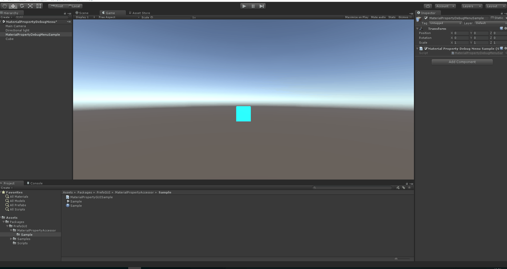

# PrefsGUI
[](https://openupm.com/packages/ga.fuquna.prefsgui/)

Accessors and GUIs for persistent preference values using JSON file


```csharp
// define PrefsParams with key.
public PrefsBool prefsBool = new PrefsBool("PrefsBool");
public PrefsInt prefsInt = new PrefsInt("PrefsInt");
public PrefsFloat prefsFloat = new PrefsFloat("PrefsFloat");
public PrefsString prefsString = new PrefsString("PrefsString");
public PrefsParam<EnumSample> prefsEnum = new PrefsParam<EnumSample>("PrefsEnum");
public PrefsColor prefsColor = new PrefsColor("PrefsColor");
public PrefsVector2 prefsVector2 = new PrefsVector2("PrefsVector2");
public PrefsVector3 prefsVector3 = new PrefsVector3("PrefsVector3");
public PrefsVector4 prefsVector4 = new PrefsVector4("PrefsVector4");
public PrefsAny<CustomClass> prefsClass = new PrefsAny<CustomClass>("PrefsClass");
public PrefsList<CustomClass> prefsList = new PrefsList<CustomClass>("PrefsList");


public void DoGUI()
{
    prefsBool.DoGUI();

    // Return true if value was changed
    var changed = prefsInt.DoGUI();
    if (changed)
    {
        // Implicitly convert
        int intValue = prefsInt;
        Debug.Log("Changed. " + intValue);
    }

    prefsFloat.DoGUI();
    prefsFloat.DoGUISlider();
    prefsString.DoGUI();
    prefsEnum.DoGUI();
    prefsColor.DoGUI();
    prefsVector2.DoGUI();
    prefsVector2.DoGUISlider();
    prefsVector3.DoGUI();
    prefsVector3.DoGUISlider();
    prefsVector4.DoGUI();
    prefsVector4.DoGUISlider();
    prefsClass.DoGUI();
    prefsList.DoGUI();
}
```

## Installation

### Dependencies

- [RapidGUI](https://github.com/fuqunaga/RapidGUI)

### Install via OpenUPM

The package is available on the [openupm registry](https://openupm.com). It's recommended to install it via [openupm-cli](https://github.com/openupm/openupm-cli).

```
openupm add ga.fuquna.rapidgui ga.fuquna.prefsgui
```

### Install via git URL

Add following lines to the `dependencies` section of the `Packages/manifest.json`.
```
"ga.fuquna.rapidgui": "https://github.com/fuqunaga/RapidGUI.git",
"ga.fuquna.prefsgui": "https://github.com/fuqunaga/PrefsGUI.git"
```

### Install via traditional `.unitypackage`

Download a `.unitypackage` file from the [Release page](https://github.com/fuqunaga/PrefsGUI/releases).

## PrefsSearch


Display loaded PrefsParams with partial key match


## EditorWindow


- **Window -> PrefsGUI**
- Display all loaded prefs that can be modiefied
- You can also feed back the current value as default value
- You can edit the key prefix for each GameObject by displaying it in order of GameObject

### JSON file path
```
Application.persistentDataPath + "/Prefs.json"
```

You can customize by placing PrefsWrapperPathCustom in the scene and set `_path` field.
also can use the Special folders and environment variables.
```
- %dataPath% -> Application.dataPath
- %companyName% -> Application.companyName
- %productName% -> Application.productName
- other %[word]% -> System.Environment.GetEnvironmentVariable([word])
```


## MaterialPropertyDebugMenu

Auto create material GUI menu




## Sync Prefs over network

**PrefsGUISyncUNET**
https://github.com/fuqunaga/PrefsGUISyncUNET


## References

- **RapidGUI**
https://github.com/fuqunaga/RapidGUI
- **PrefsGUISyncUNET**
https://github.com/fuqunaga/PrefsGUISyncUNET
