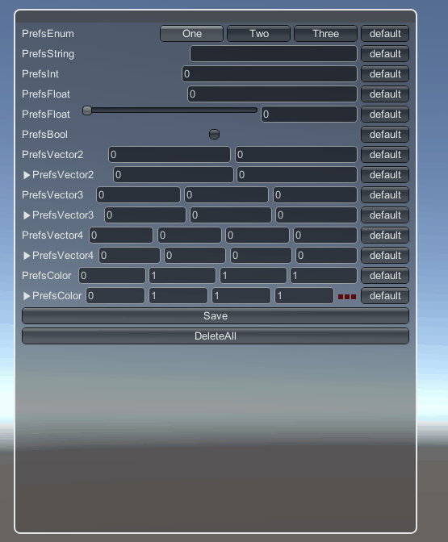

# PrefsGUI

Accessor and GUI set for Unity PlayerPrefs / JSON file

[Unity Package](PrefsGUI.unitypackage)



```csharp
public class PrefsGUISample : PrefsGUISampleBase
{
    [System.Serializable]
    public class PrefsEnum : PrefsParam<EnumSample>
    {
        public PrefsEnum(string key, EnumSample defaultValue = default(EnumSample)) : base(key, defaultValue) { }
    }

    // define PrefsParams with key.
    public PrefsEnum _prefsEnum = new PrefsEnum("PrefsEnum");
    public PrefsString _prefsString = new PrefsString("PrefsString");
    public PrefsInt _prefsInt = new PrefsInt("PrefsInt");
    public PrefsFloat _prefsFloat = new PrefsFloat("PrefsFloat");
    public PrefsBool _prefsBool = new PrefsBool("PrefsBool");
    public PrefsVector2 _prefsVector2 = new PrefsVector2("PrefsVector2");
    public PrefsVector3 _prefsVector3 = new PrefsVector3("PrefsVector3");
    public PrefsVector4 _prefsVector4 = new PrefsVector4("PrefsVector4");
    public PrefsColor _prefsColor = new PrefsColor("PrefsColor");

    protected override void OnGUIInternal()
    {
        _prefsEnum.OnGUI();
        _prefsString.OnGUI();
        _prefsInt.OnGUI();
        _prefsFloat.OnGUI();
        _prefsFloat.OnGUISlider();
        _prefsBool.OnGUI();
        _prefsVector2.OnGUI();
        _prefsVector2.OnGUISlider();
        _prefsVector3.OnGUI();
        _prefsVector3.OnGUISlider();
        _prefsVector4.OnGUI();
        _prefsVector4.OnGUISlider();
        _prefsColor.OnGUI();

        // return true if value was changed
        if ( _prefsColor.OnGUISlider())
        {
            // use as native type
            Color color = _prefsColor;
            Debug.Log("Changed. " + color);
        }

        if (GUILayout.Button("Save")) Prefs.Save();
        if (GUILayout.Button("DeleteAll")) Prefs.DeleteAll();
    }
}
```


# EditorWindow


- List up Prefs and can modify 
- You can also feed back the current value as default value
- You can edit the key prefix for each GameObject by displaying it in order of GameObject


# SyncOverUNET


- auto sync All Prefs
- You can ignore it by specifying it with EditorWindow


# Switch PlayerPrefs / JSON

Switch using at PrefsWrapper.cs
https://github.com/fuqunaga/PrefsGUI/blob/master/Assets/Packages/PrefsGUI/Scripts/PrefsWrapper.cs#L5-L6

## JSON file path
```
Application.persistentDataPath + "/Prefs.json"
```


# MaterialPropertyDebugMenu

Auto create material GUI menu


